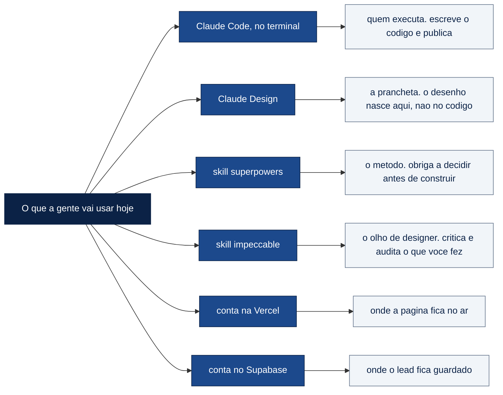

# Mapa da aula, em mermaid, pra colar no Excalidraw

Três diagramas. Cada bloco abaixo é pra copiar inteiro e colar no Excalidraw em
**Menu → Mermaid to Excalidraw** (ou `Ctrl+Shift+M`, dependendo da versão).

Os três foram passados pelo conversor de verdade (`@excalidraw/mermaid-to-excalidraw`)
rodando dentro do Chrome, e voltaram como **elementos editáveis**, não como figura
chapada. Ou seja: você move, redimensiona, muda cor e escreve em cima ao vivo.

| Mapa | Pra que serve | Sai com |
|---|---|---|
| 1 · Ferramentas | abertura da aula, o alinhamento do que é novo | 13 caixas, 12 setas |
| 2 · A espinha | **o mapa principal**, o que você toca com eles | 8 caixas, 6 losangos, 19 setas |
| 3 · O detalhe | quando alguém pedir "e dentro de cada fase?" | 31 caixas, 6 losangos, 36 setas |

---

## O que eu medi antes de escrever, e por que isso mudou o desenho

Rodei o conversor real em 34 casos. O que importa saber:

**`subgraph` está fora, e isso não é preferência.** Testei quatro formas: um nível,
aninhado, com aresta entre grupos, e um grupo sozinho sem aresta nenhuma. **Nos quatro
o diagrama inteiro virou UM elemento do tipo `image`, com zero rótulo.** Uma figura
chapada. Você não move um passo de dentro dela, não muda uma cor, não escreve em cima.
Como o teu uso é exatamente tocar no diagrama ao vivo, agrupar por `subgraph` mataria
o entregável. O agrupamento aqui é feito por **cor**, com `classDef`, que sobrevive.

**O que sobrevive à importação** (medido, não deduzido):

| Recurso | Resultado |
|---|---|
| retângulo `["..."]`, losango `{"..."}`, elipse `(("..."))` | vira forma editável |
| `classDef` e `style` com `fill` e `stroke` | **cor preservada** |
| `color:#ffffff` no `classDef` | **cor do texto preservada** |
| `stroke-dasharray:5 5` | vira traço `dashed` |
| rótulo em aresta `-->|"texto"|` | vira texto editável na seta |
| acento e cedilha dentro de aspas | preservados |
| `·`, `--prod`, vírgula, barra, dois-pontos | passam |

**O que quebra:**

| Recurso | O que acontece |
|---|---|
| `subgraph` | diagrama inteiro vira imagem chapada |
| parêntese **sem aspas** no rótulo: `a[Fase 1 (fundação)]` | **parse error**, não importa nada |
| ` ` | não quebra linha, aparece a tag ` ` escrita dentro da caixa |

Daí as duas regras se você for editar os mapas abaixo: **todo rótulo entre aspas
duplas**, e **nada de ` `**. Se precisar de duas linhas, faz duas caixas.

---

## Mapa 1 · As ferramentas (a abertura)

Esse é o primeiro alinhamento. Antes de qualquer mão na massa, a sala precisa saber
que são seis coisas, e que cada uma tem um trabalho só.

---

## Mapa 2 · A espinha do método (o mapa principal)

Seis fases, seis portões. **O portão é o que faz isso ser método e não lista.** Cada
seta de volta é um "você não passa daqui".

```mermaid
flowchart TD
  ini(("Comeca aqui")) --> f1

  f1["FASE 1 · FUNDACAO. o porque, antes de qualquer tela"]
  f1 --> p1{"PORTAO 1. a spec cabe em 15 linhas e voce aprovou"}
  p1 -->|"nao fecha"| f1
  p1 -->|"fechou"| f2

  f2["FASE 2 · PROTOTIPACAO. o desenho, todo no Claude Design"]
  f2 --> p2{"PORTAO 2. o hero esta aprovado e o arquivo saiu pro disco"}
  p2 -->|"nao fecha"| f2
  p2 -->|"fechou"| f3

  f3["FASE 3 · HANDOFF pro Claude Code, e a primeira critica"]
  f3 --> p3{"PORTAO 3. os achados foram CORRIGIDOS, nao so lidos"}
  p3 -->|"nao fecha"| f3
  p3 -->|"fechou"| f4

  f4["FASE 4 · AS TRES DEFINICOES ANTES DE SUBIR"]
  f4 --> p4{"PORTAO 4. campos travados, dominio resolvido, destino do lead escrito"}
  p4 -->|"nao fecha"| f4
  p4 -->|"fechou"| f5

  f5["FASE 5 · DEPLOY. banco, Vercel e seguranca"]
  f5 --> p5{"PORTAO 5. um lead de teste caiu no banco de verdade"}
  p5 -->|"nao fecha"| f5
  p5 -->|"fechou"| f6

  f6["FASE 6 · VALIDACAO VISUAL do que subiu"]
  f6 --> p6{"PORTAO 6. voce MOSTROU a tela. dizer que funcionou nao vale"}
  p6 -->|"nao fecha"| f6
  p6 -->|"fechou"| fim(("Pagina no ar, capturando lead"))

  classDef fase fill:#0B2246,stroke:#0B2246,color:#ffffff
  classDef portao fill:#1C498C,stroke:#0B2246,color:#ffffff
  classDef ponta fill:#3DA0F9,stroke:#1C498C,color:#0B2246
  class f1,f2,f3,f4,f5,f6 fase
  class p1,p2,p3,p4,p5,p6 portao
  class ini,fim ponta
```

---

## Mapa 3 · O detalhe de cada fase

Esse é o que responde "e o que eu faço dentro de cada uma?". É grande de propósito:
serve pra abrir uma fase quando alguém travar, não pra mostrar inteiro de uma vez.

```mermaid
flowchart TD
  f1["FASE 1 · FUNDACAO"]
  f1 --> a1["Quem e o publico, na situacao real dele"]
  a1 --> a2["Qual e o objetivo da pagina. UMA acao, nao tres"]
  a2 --> a3["Qual e a promessa, na sua frase e nao na do setor"]
  a3 --> a4["Como voce chama atencao. o gancho da primeira tela"]
  a4 --> a5["Identidade visual: logo, e as cores em hex se voce tiver"]
  a5 --> a6["3 paginas em que VOCE se inscreveu, com o rotulo do que gostou"]
  a6 --> a7["Quais perguntas o lead responde, e o que ele ganha por cada campo"]
  a7 --> p1{"PORTAO 1"}

  p1 --> f2["FASE 2 · PROTOTIPACAO"]
  f2 --> b1["Desenha no Claude Design. Tudo la, nada no codigo ainda"]
  b1 --> b2["Comeca pelo hero. Paleta e clima do resto derivam dele"]
  b2 --> b3["Uma secao por rodada, uma dimensao por vez"]
  b3 --> b4["Tira o arquivo do Claude Design pro disco"]
  b4 --> p2{"PORTAO 2"}

  p2 --> f3["FASE 3 · HANDOFF e CRITICA"]
  f3 --> c1["Entrega o arquivo pro Claude Code no terminal"]
  c1 --> c2["Reconstroi em cima do template, que ja tem o formulario endurecido"]
  c2 --> c3["Roda o audit e o critique do impeccable"]
  c3 --> c4["Corrige tudo em UM lote, e depois confere o diff"]
  c4 --> p3{"PORTAO 3"}

  p3 --> f4["FASE 4 · AS TRES DEFINICOES"]
  f4 --> d1["Trava os campos do formulario. As perguntas SAO o banco"]
  d1 --> d2["Resolve o dominio proprio. Se nao tiver, compra"]
  d2 --> d3["Escreve pra onde o lead vai depois do botao"]
  d3 --> p4{"PORTAO 4"}

  p4 --> f5["FASE 5 · DEPLOY"]
  f5 --> e1["Cria a tabela no Supabase com o SQL colado inteiro"]
  e1 --> e2["Liga o formulario no banco e manda um lead de teste"]
  e2 --> e3["Sobe com o vercel --prod"]
  e3 --> e4["Roda a verificacao de seguranca antes de divulgar"]
  e4 --> p5{"PORTAO 5"}

  p5 --> f6["FASE 6 · VALIDACAO VISUAL"]
  f6 --> g1["Abre a URL de producao em aba anonima"]
  g1 --> g2["Abre no celular de verdade, nao no simulador"]
  g2 --> g3["Envia um lead pela pagina no ar e vai olhar no banco"]
  g3 --> p6{"PORTAO 6"}
  p6 --> fim["Pagina no ar, capturando lead"]

  classDef fase fill:#0B2246,stroke:#0B2246,color:#ffffff
  classDef portao fill:#1C498C,stroke:#0B2246,color:#ffffff
  classDef passo fill:#F1F5F9,stroke:#64748B,color:#0B2246
  class f1,f2,f3,f4,f5,f6 fase
  class p1,p2,p3,p4,p5,p6 portao
  class a1,a2,a3,a4,a5,a6,a7,b1,b2,b3,b4,c1,c2,c3,c4,d1,d2,d3,e1,e2,e3,e4,g1,g2,g3,fim passo
```

---

## A tabela que o diagrama não cabe: qual ferramenta entra em qual fase

Isso vale mais como tabela do que como caixinha. Vira slide ou vira fala.

| Fase | Quem faz o trabalho | O que você digita |
|---|---|---|
| 1 · Fundação | **superpowers brainstorming** | "vamos fazer a página de inscrição do meu webinário. Me entrevista antes de escrever nada" |
| 2 · Prototipação | **Claude Design** | vai pro claude.ai, não pro terminal |
| 3 · Handoff e crítica | **Claude Code** + **impeccable** | `/impeccable audit` e `/impeccable critique` |
| 4 · As três definições | **Claude Code** (é conversa, não código) | "quais campos vão pro banco, e o que a página devolve por cada um" |
| 5 · Deploy | **Supabase** + **Vercel** | o SQL colado inteiro, depois `vercel --prod` |
| 6 · Validação visual | **você**, com os próprios olhos | nada. Isso é olhar a tela |

---

## As cores, e de onde elas vêm

Não escolhi por gosto. É a paleta da marca comercial do CDV:

| Cor | Hex | Onde entra no mapa |
|---|---|---|
| azul escuro | `#0B2246` | as caixas de FASE |
| azul principal | `#1C498C` | os losangos de PORTÃO |
| azul claro | `#3DA0F9` | começo e fim |
| fundo | `#F1F5F9` | os passos dentro de cada fase |
| cinza | `#64748B` | contorno dos passos |

Se você quiser trocar, é uma linha por `classDef`. Só lembra de manter texto branco
em cima de `#0B2246` e de `#1C498C`, porque os dois são escuros demais pra texto
escuro em cima.
